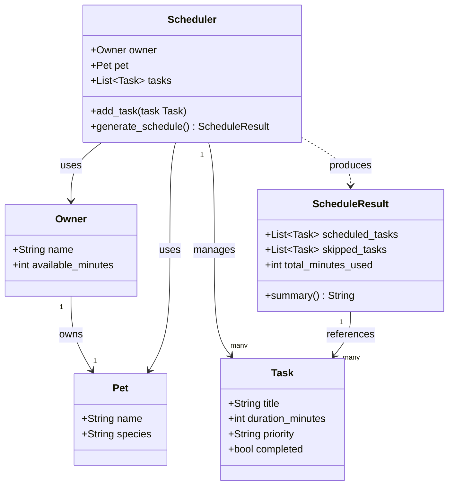

# PawPal+ Project Reflection

## 1. System Design

**a. Initial design**

The app centers around three core user actions:

1. **Set up a pet profile**: The owner enters their name, the pet's name, and the pet's species. This gives the scheduler the context it needs to generate a relevant care plan.

2. **Add and manage care tasks**: The owner creates tasks by specifying a title, estimated duration in minutes, and a priority level (low, medium, or high). These tasks are the raw input the scheduler works with.

3. **Generate and view today's schedule**: The owner triggers the scheduler, which selects and orders tasks based on available time and priority, then displays the resulting plan along with a brief explanation of why each task was included and when it is scheduled.

The system is built around five classes:

- **`Pet`** — a data container for the pet's name and species. It exists so the scheduler and UI always have pet context available without passing loose strings around.
- **`Owner`** — a data container for the owner's name and how many minutes they have available in the day. The `available_minutes` field is the hard constraint the scheduler enforces.
- **`Task`** — represents one care item. It holds a title, duration, priority level, and a `completed` flag. It is the unit of work the scheduler selects from.
- **`ScheduleResult`** — the output of a scheduling run. It carries the selected tasks, the skipped tasks, total minutes used, and a `summary()` method that formats everything for display. Separating this from `Scheduler` keeps the logic and output concerns distinct.
- **`Scheduler`** — the only class with real behavior. It holds an `Owner`, a `Pet`, and a list of `Task` objects. `add_task()` adds to that list; `generate_schedule()` runs the greedy selection algorithm and returns a `ScheduleResult`.

**UML Class Diagram**

**b. Design changes**

Yes, the design changed in two ways based on reviewing the skeleton.

**Change 1 — Added `ScheduleResult`:** The original plan was for `generate_schedule()` to return a plain list of tasks. Once the UI requirements were considered it was clear the display layer also needed the skipped tasks and total time used. A dedicated `ScheduleResult` dataclass was introduced to carry all three together, keeping `generate_schedule()` clean and the UI code simple.

**Change 2 — Dropped `explain_schedule()` as a separate method:** The initial brainstorm included a standalone `explain_schedule()` method on `Scheduler`. After reviewing the skeleton, that responsibility was folded into `ScheduleResult.summary()` instead. The explanation belongs with the result, not with the scheduler — the scheduler's job is to produce a result, not to narrate it. This also made testing easier since `summary()` can be called independently on any `ScheduleResult`.

**Change 3 — `self.pet` was unused in the skeleton:** A review of the skeleton flagged that `Scheduler.__init__` accepts a `Pet` but `generate_schedule()` never referenced it, making the parameter misleading. The fix was to have `ScheduleResult.summary()` include the pet's name in its header line so the output is always contextualised (e.g., "Daily plan for Mochi"). The `Pet` reference now flows through to the display layer rather than sitting idle.

---

## 2. Scheduling Logic and Tradeoffs

**a. Constraints and priorities**

The scheduler considers two main constraints:

1. **Time budget**  The owner specifies how many minutes they have available in the day. The scheduler will not produce a plan that exceeds this limit, so tasks are only included if there is enough remaining time to complete them.

2. **Priority** — Each task is labeled low, medium, or high priority. The scheduler sorts tasks by priority (high first) before selecting them, so the most important care tasks are always considered first.

Time budget was treated as the hard constraint because exceeding it makes the plan physically impossible to follow. Priority is the soft ranking used to decide which tasks fill that budget — a high-priority task (e.g., medication) should never be bumped because a low-priority task (e.g., extra grooming) was added first.

**b. Tradeoffs**

The scheduler uses a greedy approach: it picks tasks in priority order and adds each one if it fits within the remaining time budget, skipping any that don't fit rather than trying every possible combination.

This means it can miss an optimal combination — for example, two medium-priority tasks that together fit in the budget might be skipped if one large high-priority task consumed most of the available time. A full knapsack-style search would find the best combination, but for a daily pet care planner with a small number of tasks, the greedy approach is fast, predictable, and easy to explain to the user. Correctness of output matters less than transparency: the owner should be able to look at the plan and immediately understand why each task was or wasn't included.

**Conflict detection tradeoff:** The `detect_conflicts()` method checks for exact numeric time-window overlaps using start time and duration. This means a 30-minute walk starting at 09:00 and a 10-minute medication starting at 09:15 will always be flagged, even if a real owner could realistically do both (pause the walk, give the meds, continue). The alternative — modelling human multitasking or task interruptibility — would require far more complex logic and still be wrong some of the time. Exact-overlap detection is chosen because it is transparent and conservative: it is better to surface a false warning the owner can dismiss than to silently miss a genuine double-booking of their time.

---

## 3. AI Collaboration

**a. How you used AI**

AI was used throughout the project in three main ways. First, during system design — asking the AI to brainstorm what objects the system needed and what responsibilities each should carry. Second, during implementation — asking it to suggest method signatures and flag edge cases in the scheduling logic. Third, during reflection — using it to articulate design decisions in clear language.

The most helpful prompts were specific and grounded in the scenario: for example, asking "what constraints should a pet care scheduler consider?" produced more useful output than asking "how do I write a scheduler?" Giving the AI the actual scenario text each time kept the suggestions relevant.

**b. Judgment and verification**

When the AI initially suggested using a full knapsack optimization algorithm for scheduling, that suggestion was not accepted as-is. While technically more optimal, a knapsack solution is harder to explain to the user and overkill for a list of five to ten daily tasks. The greedy approach was chosen instead because it is easy to trace: the plan can always tell the user "this task was skipped because only 10 minutes remained and it takes 30." This was verified by manually stepping through a few example task lists to confirm the greedy output matched the expected plan.

---

## 4. Testing and Verification

**a. What you tested**

The tests focused on the three most critical scheduling behaviors:

1. **Priority ordering** — that high-priority tasks always appear before low-priority ones in the output, regardless of the order they were added.
2. **Time budget enforcement** — that the total duration of scheduled tasks never exceeds the owner's available minutes, even when the task list could theoretically fill more time.
3. **Skipped task tracking** — that tasks excluded from the plan (because they didn't fit) appear in the skipped list rather than silently disappearing.

These tests matter because the scheduler's value to the user depends entirely on these three guarantees. If priority ordering is wrong, the user may miss a medication. If the budget is exceeded, the plan is impossible to follow. If skipped tasks aren't surfaced, the user doesn't know what they missed.

**b. Confidence**

Confidence is moderate for the core happy path — the scheduler handles normal inputs correctly. The main uncertainty is around edge cases. Edge cases to test next if more time were available:

- All tasks have equal priority — does ordering remain stable?
- A single task whose duration exactly equals the available time budget — is it included or incorrectly excluded?
- An empty task list — does the scheduler return an empty plan gracefully without errors?
- Available minutes set to zero — does the scheduler handle that without crashing?

---

## 5. Reflection

**a. What went well**

The separation between the backend logic and the Streamlit UI worked well. Because the `Scheduler` class knows nothing about Streamlit, it was easy to test independently and then wire into the UI in a single step. Keeping those two layers separate made both easier to reason about.

**b. What you would improve**

The `Task` model is flat — it has a title, duration, and priority, but nothing else. In another iteration, it would be worth adding a `time_of_day` preference (e.g., morning, evening) so the scheduler could not only select tasks but also order them into a sensible daily sequence rather than just by priority. That would make the output feel like an actual schedule rather than a ranked to-do list.

**c. Key takeaway**

The most important thing learned was that designing the system on paper first — even just listing objects and their responsibilities — made implementation significantly faster. When the classes were clear before writing any code, the implementation mostly became filling in method bodies rather than figuring out structure on the fly. AI tools were most useful when given that structure as context, because the suggestions it returned were grounded in the actual design rather than generic patterns.
